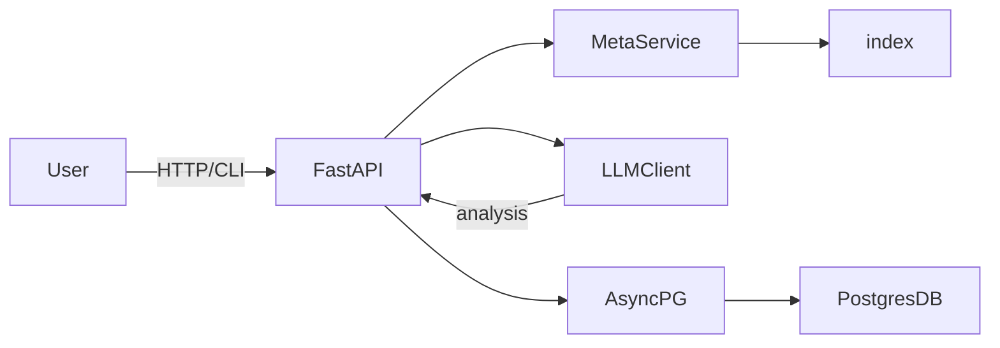

# Product Requirements Document (PRD): On-Premises Data Science Agent

## 1. Purpose and Scope

**Purpose:**
Provide a self‑contained, on‑prem data‑science agent that enables business users and analysts to interact with live Postgres databases via natural‑language queries, generating SQL, executing analytics, and returning results—including LLM‑powered summaries—without any data leaving the client network.

**Scope:**

* Connect to Postgres with user‑supplied credentials
* Persist and manage schema metadata in an in‑memory FAISS index
* Translate NL to SQL via local or cloud LLMs
* Execute `SELECT` queries safely with asyncpg
* Expose HTTP (FastAPI) and CLI interfaces
* Support configuration, logging, and auditability
* Deliver as Docker image or standalone Python package

---

## 2. Objectives and Success Metrics

| Objective                                          | Success Metric                                            |
| -------------------------------------------------- | --------------------------------------------------------- |
| Enable non‑technical users to run analytics via NL | ≥90% of pilot queries return correct SQL on first attempt |
| Maintain sub‑second end‑to‑end latency             | 95th percentile response time < 1s                        |
| Ensure data never leaves client network            | 0 incidents of data exfiltration                          |
| Simplify deployment                                | <30 minutes to install + configure                        |
| Provide reliable uptime                            | 99.9% agent availability over 30 days                     |

---

## 3. Stakeholders

* **Product Owner:** You (project lead)
* **End Users:** Data analysts, business analysts, BI teams
* **IT/DevOps:** Responsible for deployment, security, updates
* **Data Engineers:** Seed test data, manage DB migrations
* **Legal & Compliance:** Validate on‑prem data handling policies

---

## 4. User Personas

**Persona 1: Data Analyst (Alice)**

* Wants quick ad‑hoc queries without writing SQL
* Prefers a natural‑language chatbot interface

**Persona 2: IT Administrator (Bob)**

* Manages server deployments and container orchestration
* Needs secure, auditable software that fits corporate policy

**Persona 3: Data Engineer (Carol)**

* Sets up CI/CD and integration testing
* Ensures schema introspection is accurate and up‑to‑date

---

## 5. Use Cases

1. **Basic Query & Results**: Analyst asks “Top 10 customers last quarter,” agent returns a table.
2. **Result Analysis**: Analyst adds `analyze=true`; agent returns LLM‑powered insights and chart suggestions.
3. **Schema Exploration**: User calls `/schema` to discover table/column names.
4. **Health Monitoring**: Automated health checks via `/health` endpoint.
5. **CI/CD Test**: Integration tests run against ephemeral Postgres + agent containers.

---

## 6. Functional Requirements

### 6.1. Database Connectivity

* **FR‑DB‑1:** Accept connection parameters (`DB_HOST`, `DB_USER`, `DB_PASS`, etc.)
* **FR‑DB‑2:** Validate connectivity on startup; fail fast if unreachable

### 6.2. Natural‑Language Interface

* **FR‑NL‑1:** Expose `/query` POST endpoint:

  * Request: `{ question: string, analyze?: boolean }`
  * Response: `{ rows: JSON[], analysis?: string }`
* **FR‑NL‑2:** Provide CLI command `agent query "..." [--analyze]`

### 6.3. Metadata Management

* **FR‑MD‑1:** Introspect public schema tables, columns, PK/FK
* **FR‑MD‑2:** Chunk metadata into documents and embed
* **FR‑MD‑3:** Build and persist FAISS index on disk
* **FR‑MD‑4:** Load index into memory on startup (index cached)

### 6.4. Query Generation & Execution

* **FR‑QS‑1:** Retrieve top‑k relevant schema chunks via FAISS
* **FR‑QS‑2:** Render NL→SQL prompt using Jinja2 template
* **FR‑QS‑3:** Call LLM (local or cloud) to generate SQL
* **FR‑QS‑4:** Sanitize and validate SQL AST (only `SELECT`)
* **FR‑QS‑5:** Auto‑append `LIMIT 1000` if missing
* **FR‑QS‑6:** Execute SQL via asyncpg pool, return JSON rows

### 6.5. LLM‑Powered Analysis

* **FR‑LLM‑1:** If `analyze=true`, prompt LLM with query results
* **FR‑LLM‑2:** Return human‑readable summary and chart suggestions

### 6.6. Configuration & Management

* **FR‑CFG‑1:** Use Pydantic to load from env vars or `config.yml`
* **FR‑CFG‑2:** Support flags: `--wipe-on-exit`, `LOG_LEVEL`, `CACHE_PATH`
* **FR‑CFG‑3:** Provide `/health` endpoint reporting DB + index status

### 6.7. Logging & Auditing

* **FR‑LOG‑1:** Log requests, generated SQL, execution metrics locally
* **FR‑LOG‑2:** Support audit log rotation and secure wipes
* **FR‑LOG‑3:** Do not log row‑level data

---

## 7. Non‑Functional Requirements

| Category            | Requirement                                                       |
| ------------------- | ----------------------------------------------------------------- |
| **Performance**     | 95th percentile latency < 1s for metadata lookup + SQL exec       |
| **Scalability**     | Support up to 50 concurrent users with worker scaling             |
| **Reliability**     | 99.9% uptime; graceful degradation if LLM unavailable             |
| **Security**        | Data residency on‑prem; TLS for cloud LLM; no external data leaks |
| **Maintainability** | Modular code; ≥80% unit‑test coverage; clear docs                 |
| **Usability**       | Auto‑generated OpenAPI docs; minimal install steps                |

---

## 8. System Architecture Overview

* **FastAPI Server**: HTTP/CLI interface, routing, validation
* **asyncpg Pool**: Non‑blocking DB connections
* **Meta Service**: Schema introspection, FAISS index management
* **LLM Client**: Local inference via `llama-cpp-python` or cloud API
* **Cache Layer**: LRU for hot schema chunks
* **Logging**: Structured, local file logging

---

## 9. API Specification

| Endpoint  | Method | Request Body                              | Response                                |
| --------- | ------ | ----------------------------------------- | --------------------------------------- |
| `/health` | GET    | —                                         | `{ status: "ok", db: "connected" }`     |
| `/schema` | GET    | —                                         | `[{ table: "orders", columns: [...] }]` |
| `/query`  | POST   | `{ question: string, analyze?: boolean }` | `{ rows: [...], analysis?: string }`    |

---

## 10. Technical Risks & Mitigations

| Risk                               | Mitigation                                  |
| ---------------------------------- | ------------------------------------------- |
| Schema drift invalidates index     | Hook migrations to re‑embed, poll hourly    |
| LLM generates invalid SQL          | SQL AST validation; fallback to error msg   |
| Large schemas inflate index memory | Chunk granularity; quantize embeddings      |
| High concurrency overloads agent   | Scale workers; limit max concurrent queries |

---

## 11. Roadmap & Milestones

| Milestone                      | Target Completion | Scope                                               |
| ------------------------------ | ----------------- | --------------------------------------------------- |
| **MVP**                        | Week 2            | Health check, DB ping, schema endpoint, dummy FAISS |
| **NL→SQL Prototype**           | Week 4            | FAISS lookup, prompt → dummy SQL, exec              |
| **LLM Integration & Analysis** | Week 6            | Cloud/local LLM, analysis endpoint                  |
| **Performance & Caching**      | Week 8            | LRU cache, quantized index, worker tuning           |
| **Testing & Hardening**        | Week 10           | Unit + integration tests, security audit            |
| **GA Release**                 | Week 12           | Docker image, PyPI package, docs                    |

---

*End of PRD.*
