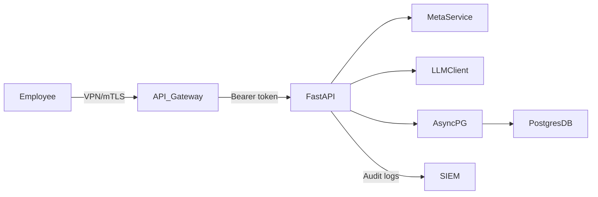

# Enterprise Deployment Considerations

This document describes how to secure your on‑premises Data Science Agent for corporate rollout and when to incorporate these features into your development roadmap.

---

## 1. Network Access Controls

* **Deploy inside corporate network**: Run the agent in a VM or Kubernetes cluster on a private subnet/DMZ. Do not expose ports to the public internet.
* **VPN-only ingress**: Restrict firewall rules (iptables, security groups) to allow traffic only from the corporate VPN subnet.
* **Mutual TLS (mTLS)**: Optionally front FastAPI behind an Nginx/Envoy proxy that enforces client certificates for zero-trust authentication.

---

## 2. Identity & Authorization (SSO)

1. **Select SSO protocol**: Common choices are SAML 2.0 (Okta, ADFS) or OIDC/OAuth2 (Azure AD, Keycloak).
2. **Auth Proxy / API Gateway**: Use Kong, Ambassador, or similar to terminate SSO flows, validate assertions/JWTs, and forward bearer tokens to FastAPI.
3. **FastAPI integration**: Leverage FastAPI’s security dependencies to decode & verify tokens, extract user identity and groups, and enforce RBAC on endpoints.

   ```python
   token = Depends(oauth2_scheme)
   payload = jwt.decode(token, JWKS_KEY,…)
   username = payload["preferred_username"]
   roles    = payload.get("groups", [])
   ```
4. **DB session mapping** (optional): Push user identity into Postgres sessions via `SET ROLE` or generate short‑lived credentials per user group.

---

## 3. Architecture Overview



**Key points**:

* All traffic flows through corporate VPN and/or mTLS proxy.
* Authorization decisions are made at the gateway and/or within FastAPI.
* Audit logs capture user identity, query text, and timestamps.

---

## 4. Recommended Timing

| Stage                            | Action                                                                                 | Priority  |
| -------------------------------- | -------------------------------------------------------------------------------------- | --------- |
| **Pre‑MVP Planning**             | Document enterprise requirements: VPN, SSO protocol, RBAC model, audit logging schema. | High      |
| **MVP (Weeks 1–4)**              | Focus on core NL→SQL, metadata, DB connectivity, and basic security (env var secrets). | Immediate |
| **Post‑MVP (Weeks 5–8)**         | Prototype SSO integration (Keycloak or sandbox IdP), add token-based auth in FastAPI.  | Medium    |
| **Enterprise Beta (Weeks 9–12)** | Implement VPN/mTLS restrictions, integrate API gateway, finalize audit logging & RBAC. | High      |

**Guidance:**

* **Plan early**: Capture your corporate requirements up front so your architecture can accommodate them without rework.
* **Delay heavy integration**: You don’t need full SSO/mTLS before MVP—just stub out security hooks and use simple token checks.
* **Prioritize after core functionality**: Once your agent reliably answers NL queries and connects to Postgres, focus on enterprise–grade deployment features.

---

*End of document.*
