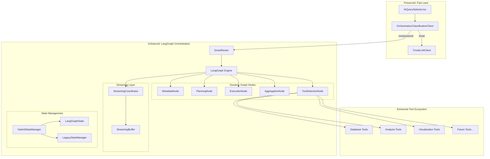

# LangGraph Integration Strategy for Ceneca's Multi-Tier LLM Infrastructure

## Executive Summary

This document outlines a comprehensive strategy for integrating LangGraph into Ceneca's existing multi-tier LLM infrastructure to enable advanced inter-agent orchestration, dynamic graph construction, and transparent streaming capabilities. The integration preserves the high-performance trivial routing (200-500ms) while dramatically enhancing the overpowered LLM tier with sophisticated workflow orchestration.

## 🎯 Integration Objectives

### Primary Goals
1. **Complex Branching & Dynamic Graphs**: Enable AI agents to construct and modify execution graphs based on runtime analysis
2. **Transparent Streaming**: Maintain streaming at every level without breaking user experience
3. **Massive Parallelism**: Scale concurrent operations beyond current 4-operation limit
4. **Dynamic Tool Selection**: Support extensible tool ecosystem with intelligent selection
5. **Database-Driven Graph Construction**: Let AI decide optimal data fetching strategies
6. **Industry-Standard Error Recovery**: Implement circuit breakers, retries, and adaptive fallbacks

### Scope Boundaries
- **Preserve**: Trivial LLM classification and routing (independent of LangGraph)
- **Enhance**: Overpowered LLM operations with LangGraph orchestration
- **Future-Ready**: Architecture supports human-in-the-loop (but not immediate requirement)

## 🏗️ Architecture Overview

### Current vs. Enhanced Architecture



## 🧠 LangGraph State Management Strategy

### Recommendation: Hybrid State Management

After analyzing LangGraph's capabilities, I recommend a **hybrid approach** that preserves your investment while gaining LangGraph's advanced features:

```python
class HybridStateManager:
    """
    Combines LangGraph's graph state with existing session management
    """
    def __init__(self):
        self.langgraph_state = TypedDict("GraphState", {
            "question": str,
            "databases_identified": List[str],
            "execution_plan": Dict[str, Any],
            "partial_results": Dict[str, Any],
            "final_result": Dict[str, Any],
            "streaming_buffer": List[Dict[str, Any]],
            "error_history": List[Dict[str, Any]],
            "retry_count": int,
            "performance_metrics": Dict[str, Any]
        })
        
        # Preserve existing session-based state for compatibility
        self.legacy_state_manager = StateManager()
        self.session_graph_mapping = {}
    
    async def create_graph_session(self, question: str) -> str:
        """Create both legacy session and graph state"""
        session_id = await self.legacy_state_manager.create_session(question)
        
        # Initialize LangGraph state
        initial_state = {
            "question": question,
            "databases_identified": [],
            "execution_plan": {},
            "partial_results": {},
            "final_result": {},
            "streaming_buffer": [],
            "error_history": [],
            "retry_count": 0,
            "performance_metrics": {}
        }
        
        self.session_graph_mapping[session_id] = initial_state
        return session_id
```

### Why Hybrid Approach?

1. **Migration Safety**: Preserves existing session-based logic
2. **LangGraph Power**: Gains typed state, automatic persistence, time-travel debugging
3. **Performance**: Minimizes state serialization overhead
4. **Backward Compatibility**: Existing agents continue working

## 🔄 Transparent Streaming Architecture

### Challenge: LangGraph + Streaming
LangGraph doesn't natively support streaming, but we can create a transparent streaming layer:

```python
class StreamingGraphCoordinator:
    """
    Enables transparent streaming for any LangGraph workflow
    """
    def __init__(self):
        self.streaming_channels = {}
        self.node_progress_tracking = {}
    
    async def stream_graph_execution(
        self, 
        graph: CompiledGraph, 
        initial_state: Dict[str, Any],
        stream_callback: Callable[[Dict[str, Any]], None]
    ) -> AsyncIterator[Dict[str, Any]]:
        """
        Wraps LangGraph execution with streaming capabilities
        """
        session_id = str(uuid.uuid4())
        
        # Create streaming channel
        stream_queue = asyncio.Queue()
        self.streaming_channels[session_id] = stream_queue
        
        # Wrap each node with streaming capability
        async def streaming_node_wrapper(node_func):
            async def wrapper(state):
                # Emit pre-execution event
                await stream_queue.put({
                    "type": "node_start",
                    "node": node_func.__name__,
                    "timestamp": datetime.utcnow().isoformat(),
                    "state_snapshot": self._serialize_state(state)
                })
                
                try:
                    # Execute original node with streaming
                    if hasattr(node_func, 'stream_capable'):
                        # Node supports native streaming
                        async for chunk in node_func.stream(state):
                            await stream_queue.put({
                                "type": "node_chunk",
                                "node": node_func.__name__,
                                "chunk": chunk
                            })
                            yield chunk
                    else:
                        # Wrap non-streaming node
                        result = await node_func(state)
                        await stream_queue.put({
                            "type": "node_complete",
                            "node": node_func.__name__,
                            "result": self._serialize_result(result)
                        })
                        return result
                        
                except Exception as e:
                    await stream_queue.put({
                        "type": "node_error",
                        "node": node_func.__name__,
                        "error": str(e)
                    })
                    raise
            return wrapper
        
        # Start graph execution in background
        graph_task = asyncio.create_task(
            graph.ainvoke(initial_state)
        )
        
        # Stream events as they happen
        try:
            while not graph_task.done():
                try:
                    event = await asyncio.wait_for(
                        stream_queue.get(), 
                        timeout=0.1
                    )
                    yield event
                    stream_callback(event)
                except asyncio.TimeoutError:
                    continue
            
            # Get final result
            final_result = await graph_task
            yield {
                "type": "graph_complete",
                "result": final_result,
                "session_id": session_id
            }
            
        finally:
            # Cleanup
            del self.streaming_channels[session_id]
```

### Node-Level Streaming Integration

```python
class StreamingDatabaseNode:
    """
    Database operation node with native streaming support
    """
    def __init__(self):
        self.stream_capable = True
    
    async def stream(self, state: Dict[str, Any]) -> AsyncIterator[Dict[str, Any]]:
        """Stream database operation progress"""
        operation_plan = state["execution_plan"]
        
        for operation in operation_plan["operations"]:
            yield {
                "type": "operation_start",
                "operation_id": operation["id"],
                "database": operation["db_type"]
            }
            
            # Execute with progress updates
            async for progress in self._execute_with_progress(operation):
                yield {
                    "type": "operation_progress",
                    "operation_id": operation["id"],
                    "progress": progress
                }
            
            yield {
                "type": "operation_complete",
                "operation_id": operation["id"]
            }
```

## ⚡ Massive Parallelism Strategy

### Beyond 4-Operation Limit

```python
class AdaptiveParallelismManager:
    """
    Dynamically scales parallelism based on resource availability and operation types
    """
    def __init__(self):
        self.database_pools = {
            "postgres": asyncio.Semaphore(8),    # Higher limit for fast queries
            "mongodb": asyncio.Semaphore(6),     # Medium limit for aggregations
            "qdrant": asyncio.Semaphore(4),      # Lower limit for vector operations
            "slack": asyncio.Semaphore(2)        # API rate limit considerations
        }
        
        self.operation_complexity_weights = {
            "simple_select": 1,
            "aggregation": 2,
            "vector_search": 3,
            "cross_join": 4
        }
    
    async def execute_parallel_operations(
        self, 
        operations: List[Operation],
        max_total_weight: int = 20
    ) -> Dict[str, Any]:
        """
        Execute operations with intelligent parallelism limits
        """
        # Group operations by database type
        grouped_ops = self._group_by_database(operations)
        
        # Calculate complexity weights
        weighted_batches = self._create_weighted_batches(
            grouped_ops, 
            max_total_weight
        )
        
        results = {}
        
        for batch in weighted_batches:
            # Execute batch with database-specific limits
            batch_tasks = []
            
            for db_type, ops in batch.items():
                semaphore = self.database_pools[db_type]
                
                for op in ops:
                    task = asyncio.create_task(
                        self._execute_with_semaphore(op, semaphore)
                    )
                    batch_tasks.append(task)
            
            # Wait for batch completion
            batch_results = await asyncio.gather(
                *batch_tasks, 
                return_exceptions=True
            )
            
            # Merge results
            for result in batch_results:
                if isinstance(result, dict) and "operation_id" in result:
                    results[result["operation_id"]] = result
        
        return results
    
    def _create_weighted_batches(
        self, 
        grouped_ops: Dict[str, List[Operation]], 
        max_weight: int
    ) -> List[Dict[str, List[Operation]]]:
        """
        Create batches that respect both parallelism and complexity limits
        """
        batches = []
        current_batch = {}
        current_weight = 0
        
        for db_type, operations in grouped_ops.items():
            for op in operations:
                op_weight = self.operation_complexity_weights.get(
                    op.complexity_type, 2
                )
                
                if current_weight + op_weight > max_weight:
                    # Start new batch
                    if current_batch:
                        batches.append(current_batch)
                    current_batch = {db_type: [op]}
                    current_weight = op_weight
                else:
                    # Add to current batch
                    if db_type not in current_batch:
                        current_batch[db_type] = []
                    current_batch[db_type].append(op)
                    current_weight += op_weight
        
        if current_batch:
            batches.append(current_batch)
        
        return batches
```

## 🛠️ Dynamic Tool Selection Architecture

### Extensible Tool Registry

```python
class DynamicToolRegistry:
    """
    Registry for dynamically discovering and selecting tools
    """
    def __init__(self):
        self.tools = {}
        self.tool_metadata = {}
        self.usage_analytics = {}
        self.performance_history = {}
    
    def register_tool(
        self, 
        tool_name: str, 
        tool_func: Callable,
        metadata: Dict[str, Any]
    ):
        """Register a new tool with metadata"""
        self.tools[tool_name] = tool_func
        self.tool_metadata[tool_name] = {
            "description": metadata.get("description"),
            "input_types": metadata.get("input_types", []),
            "output_types": metadata.get("output_types", []),
            "database_compatibility": metadata.get("database_compatibility", []),
            "estimated_duration": metadata.get("estimated_duration", 1000),
            "complexity_score": metadata.get("complexity_score", 1),
            "dependencies": metadata.get("dependencies", [])
        }
        self.usage_analytics[tool_name] = {
            "usage_count": 0,
            "success_rate": 0.0,
            "avg_duration": 0.0
        }
    
    async def select_optimal_tools(
        self, 
        context: Dict[str, Any],
        available_data: Dict[str, Any],
        target_outcome: str
    ) -> List[str]:
        """
        Intelligently select tools based on context and performance history
        """
        # Get candidate tools
        candidates = self._filter_by_compatibility(context, available_data)
        
        # Score tools based on multiple factors
        scored_tools = []
        for tool_name in candidates:
            score = await self._calculate_tool_score(
                tool_name, 
                context, 
                target_outcome
            )
            scored_tools.append((tool_name, score))
        
        # Sort by score and return top selections
        scored_tools.sort(key=lambda x: x[1], reverse=True)
        
        # Select tools that don't conflict with each other
        selected_tools = self._resolve_tool_conflicts(scored_tools)
        
        return selected_tools
    
    async def _calculate_tool_score(
        self, 
        tool_name: str, 
        context: Dict[str, Any],
        target_outcome: str
    ) -> float:
        """
        Calculate composite score for tool selection
        """
        metadata = self.tool_metadata[tool_name]
        analytics = self.usage_analytics[tool_name]
        
        # Base compatibility score
        compatibility_score = self._compatibility_score(metadata, context)
        
        # Performance score (success rate + speed)
        performance_score = (
            analytics["success_rate"] * 0.7 + 
            (1.0 / max(analytics["avg_duration"], 100)) * 0.3
        )
        
        # Relevance score (semantic similarity to target outcome)
        relevance_score = await self._semantic_relevance_score(
            metadata["description"],
            target_outcome
        )
        
        # Combined score
        total_score = (
            compatibility_score * 0.4 +
            performance_score * 0.3 +
            relevance_score * 0.3
        )
        
        return total_score

# Example tool registrations
tool_registry = DynamicToolRegistry()

# Database tools
tool_registry.register_tool("advanced_sql_analyzer", advanced_sql_analyzer, {
    "description": "Analyzes SQL performance and suggests optimizations",
    "input_types": ["sql_query", "schema_info"],
    "output_types": ["analysis_report"],
    "database_compatibility": ["postgres", "mysql"],
    "estimated_duration": 2000,
    "complexity_score": 3
})

tool_registry.register_tool("vector_similarity_search", vector_search, {
    "description": "Performs semantic similarity search on vector embeddings",
    "input_types": ["text_query", "vector_collection"],
    "output_types": ["similarity_results"],
    "database_compatibility": ["qdrant", "pinecone"],
    "estimated_duration": 500,
    "complexity_score": 2
})

# Analysis tools
tool_registry.register_tool("statistical_outlier_detector", outlier_detector, {
    "description": "Identifies statistical outliers in numeric datasets",
    "input_types": ["numeric_data"],
    "output_types": ["outlier_report"],
    "database_compatibility": ["postgres", "mongodb"],
    "estimated_duration": 1500,
    "complexity_score": 2
})

# Future visualization tools
tool_registry.register_tool("dynamic_chart_generator", chart_generator, {
    "description": "Generates interactive charts based on data patterns",
    "input_types": ["tabular_data", "chart_config"],
    "output_types": ["chart_definition"],
    "database_compatibility": ["all"],
    "estimated_duration": 800,
    "complexity_score": 1
})
```

### LangGraph Tool Selection Node

```python
class ToolSelectionNode:
    """
    LangGraph node that dynamically selects optimal tools
    """
    def __init__(self, tool_registry: DynamicToolRegistry):
        self.tool_registry = tool_registry
    
    async def __call__(self, state: Dict[str, Any]) -> Dict[str, Any]:
        """
        Select optimal tools based on current state
        """
        context = {
            "databases_available": state["databases_identified"],
            "data_types": self._infer_data_types(state),
            "complexity_preference": state.get("complexity_preference", "balanced")
        }
        
        available_data = state["partial_results"]
        target_outcome = state["question"]
        
        # Get optimal tool selection
        selected_tools = await self.tool_registry.select_optimal_tools(
            context,
            available_data,
            target_outcome
        )
        
        # Update state with tool selection
        state["selected_tools"] = selected_tools
        state["tool_selection_reasoning"] = self._generate_reasoning(
            selected_tools,
            context
        )
        
        return state
```

## 🌐 Dynamic Graph Construction

### Database-Driven Graph Builder

```python
class DatabaseDrivenGraphBuilder:
    """
    Constructs LangGraph workflows based on database analysis
    """
    def __init__(self, tool_registry: DynamicToolRegistry):
        self.tool_registry = tool_registry
        self.graph_templates = {}
        self.performance_cache = {}
    
    async def build_optimal_graph(
        self, 
        question: str,
        available_databases: List[str]
    ) -> CompiledGraph:
        """
        Dynamically construct graph based on question and available databases
        """
        # Analyze question complexity and data requirements
        analysis = await self._analyze_question_requirements(question)
        
        # Determine optimal database access patterns
        access_patterns = await self._plan_database_access(
            analysis,
            available_databases
        )
        
        # Build graph structure
        graph_builder = StateGraph(GraphState)
        
        # Add nodes based on access patterns
        if access_patterns["requires_metadata"]:
            graph_builder.add_node("metadata_collection", MetadataCollectionNode())
        
        if access_patterns["requires_parallel_queries"]:
            graph_builder.add_node("parallel_execution", ParallelExecutionNode())
        else:
            graph_builder.add_node("sequential_execution", SequentialExecutionNode())
        
        if access_patterns["requires_aggregation"]:
            graph_builder.add_node("result_aggregation", ResultAggregationNode())
        
        if analysis["complexity"] == "high":
            graph_builder.add_node("tool_selection", ToolSelectionNode(self.tool_registry))
            graph_builder.add_node("advanced_analysis", AdvancedAnalysisNode())
        
        # Add conditional edges based on runtime state
        graph_builder.add_conditional_edges(
            "metadata_collection",
            self._should_proceed_with_execution,
            {
                "proceed": "tool_selection" if analysis["complexity"] == "high" else "parallel_execution",
                "need_more_info": "metadata_collection",
                "error": END
            }
        )
        
        if "tool_selection" in graph_builder.nodes:
            graph_builder.add_conditional_edges(
                "tool_selection",
                self._determine_execution_strategy,
                {
                    "parallel": "parallel_execution",
                    "sequential": "sequential_execution",
                    "advanced": "advanced_analysis"
                }
            )
        
        # Set entry point
        graph_builder.set_entry_point("metadata_collection")
        
        # Compile and cache
        compiled_graph = graph_builder.compile()
        
        # Cache for future similar questions
        cache_key = self._generate_cache_key(question, available_databases)
        self.performance_cache[cache_key] = compiled_graph
        
        return compiled_graph
    
    async def _analyze_question_requirements(self, question: str) -> Dict[str, Any]:
        """
        Analyze question to determine graph requirements
        """
        # Use your existing OrchestrationClassificationClient
        classification = await get_classification_client().classify_operation(
            question, 
            {"type": "analysis_request"}
        )
        
        # Extend with deeper analysis
        requirements = {
            "complexity": "high" if classification["tier"] == "overpowered" else "medium",
            "estimated_time": classification["estimated_time"],
            "requires_joins": "join" in question.lower() or "combine" in question.lower(),
            "requires_aggregation": any(word in question.lower() for word in ["total", "average", "count", "sum"]),
            "requires_filtering": any(word in question.lower() for word in ["where", "filter", "specific"]),
            "data_types_needed": self._infer_data_types_from_question(question)
        }
        
        return requirements
    
    async def _plan_database_access(
        self,
        requirements: Dict[str, Any],
        available_databases: List[str]
    ) -> Dict[str, Any]:
        """
        Plan optimal database access strategy
        """
        access_plan = {
            "requires_metadata": True,  # Always start with metadata
            "requires_parallel_queries": len(available_databases) > 1 and requirements["requires_joins"],
            "database_priority": self._prioritize_databases(requirements, available_databases),
            "estimated_operations": self._estimate_operation_count(requirements),
            "parallelism_factor": min(len(available_databases) * 2, 16)  # Scale with databases
        }
        
        return access_plan
```

## 🔧 Industry-Standard Error Recovery

### Circuit Breaker + Retry Patterns

```python
class IndustryStandardErrorRecovery:
    """
    Implements circuit breaker, retry, and adaptive fallback patterns
    """
    def __init__(self):
        self.circuit_breakers = {}
        self.retry_policies = {}
        self.fallback_strategies = {}
    
    def setup_error_recovery(self):
        """Configure industry-standard error recovery patterns"""
        
        # Circuit breaker for database connections
        self.circuit_breakers["database"] = CircuitBreaker(
            failure_threshold=5,          # Open after 5 failures
            recovery_timeout=30,          # Try again after 30 seconds
            expected_exception=DatabaseError
        )
        
        # Circuit breaker for LLM API calls
        self.circuit_breakers["llm"] = CircuitBreaker(
            failure_threshold=3,          # Open after 3 failures
            recovery_timeout=60,          # Wait longer for LLM recovery
            expected_exception=(APIError, RateLimitError)
        )
        
        # Exponential backoff retry policy
        self.retry_policies["default"] = ExponentialBackoffRetry(
            max_attempts=3,
            base_delay=1.0,
            max_delay=30.0,
            exponential_base=2.0,
            jitter=True
        )
        
        # Aggressive retry for critical operations
        self.retry_policies["critical"] = ExponentialBackoffRetry(
            max_attempts=5,
            base_delay=0.5,
            max_delay=60.0,
            exponential_base=1.5,
            jitter=True
        )
        
        # Conservative retry for resource-intensive operations
        self.retry_policies["conservative"] = LinearBackoffRetry(
            max_attempts=2,
            base_delay=5.0,
            increment=5.0
        )

class ResilientGraphNode:
    """
    Base class for LangGraph nodes with built-in error recovery
    """
    def __init__(self, error_recovery: IndustryStandardErrorRecovery):
        self.error_recovery = error_recovery
        self.operation_type = "default"  # Override in subclasses
    
    async def __call__(self, state: Dict[str, Any]) -> Dict[str, Any]:
        """
        Execute node with comprehensive error recovery
        """
        circuit_breaker = self.error_recovery.circuit_breakers.get("database")
        retry_policy = self.error_recovery.retry_policies.get(self.operation_type, 
                                                             self.error_recovery.retry_policies["default"])
        
        try:
            # Execute with circuit breaker protection
            with circuit_breaker:
                result = await retry_policy.execute(
                    self._execute_core_logic,
                    state
                )
                
                # Update success metrics
                state["error_history"].append({
                    "node": self.__class__.__name__,
                    "status": "success",
                    "timestamp": datetime.utcnow().isoformat()
                })
                
                return result
                
        except CircuitBreakerOpenError:
            # Circuit breaker is open, try fallback
            return await self._execute_fallback(state)
            
        except MaxRetriesExceededError as e:
            # All retries exhausted, record failure and try graceful degradation
            state["error_history"].append({
                "node": self.__class__.__name__,
                "status": "max_retries_exceeded",
                "error": str(e),
                "timestamp": datetime.utcnow().isoformat()
            })
            
            return await self._execute_graceful_degradation(state)
            
        except Exception as e:
            # Unexpected error, record and re-raise
            state["error_history"].append({
                "node": self.__class__.__name__,
                "status": "unexpected_error",
                "error": str(e),
                "timestamp": datetime.utcnow().isoformat()
            })
            raise
    
    async def _execute_core_logic(self, state: Dict[str, Any]) -> Dict[str, Any]:
        """Override this method in subclasses"""
        raise NotImplementedError
    
    async def _execute_fallback(self, state: Dict[str, Any]) -> Dict[str, Any]:
        """Fallback logic when circuit breaker is open"""
        # Default: return state with fallback flag
        state["fallback_used"] = True
        state["partial_results"]["fallback_reason"] = "circuit_breaker_open"
        return state
    
    async def _execute_graceful_degradation(self, state: Dict[str, Any]) -> Dict[str, Any]:
        """Graceful degradation when all retries fail"""
        # Default: return simplified result
        state["degraded_mode"] = True
        state["partial_results"]["degradation_reason"] = "max_retries_exceeded"
        return state

# Example specialized nodes
class DatabaseQueryNode(ResilientGraphNode):
    """
    Database query node with database-specific error recovery
    """
    def __init__(self, error_recovery: IndustryStandardErrorRecovery):
        super().__init__(error_recovery)
        self.operation_type = "critical"  # Use aggressive retry policy
    
    async def _execute_core_logic(self, state: Dict[str, Any]) -> Dict[str, Any]:
        # Your existing database query logic
        operation = state["current_operation"]
        adapter = get_database_adapter(operation["db_type"])
        
        result = await adapter.execute(operation["params"])
        
        state["partial_results"][operation["id"]] = result
        return state
    
    async def _execute_fallback(self, state: Dict[str, Any]) -> Dict[str, Any]:
        """Try cached results or simplified query"""
        operation = state["current_operation"]
        
        # Try cached results first
        cached_result = await self._try_cached_result(operation)
        if cached_result:
            state["partial_results"][operation["id"]] = cached_result
            state["fallback_used"] = True
            return state
        
        # Try simplified query
        simplified_query = await self._simplify_query(operation)
        if simplified_query:
            try:
                adapter = get_database_adapter(operation["db_type"])
                result = await adapter.execute(simplified_query)
                state["partial_results"][operation["id"]] = result
                state["simplified_query_used"] = True
                return state
            except Exception:
                pass
        
        # Last resort: empty result
        state["partial_results"][operation["id"]] = {"error": "fallback_failed"}
        return state
```

## 📊 Implementation Roadmap

### Phase 1: Foundation (Weeks 1-3)
1. **Hybrid State Management**
   - Implement `HybridStateManager`
   - Migrate existing sessions to hybrid approach
   - Add LangGraph state type definitions

2. **Streaming Infrastructure**
   - Build `StreamingGraphCoordinator`
   - Create node-level streaming wrappers
   - Test with existing `TrivialLLMClient` (should remain untouched)

3. **Basic Graph Structure**
   - Convert existing `PlanningAgent` to LangGraph node
   - Convert `ImplementationAgent` to parallel execution nodes
   - Preserve all existing functionality

### Phase 2: Dynamic Capabilities (Weeks 4-6)
1. **Tool Registry System**
   - Implement `DynamicToolRegistry`
   - Migrate existing 5 tools to registry
   - Add tool performance tracking

2. **Graph Builder**
   - Implement `DatabaseDrivenGraphBuilder`
   - Create graph templates for common patterns
   - Add caching for similar queries

3. **Enhanced Parallelism**
   - Implement `AdaptiveParallelismManager`
   - Scale beyond 4-operation limit
   - Add database-specific optimization

### Phase 3: Intelligence & Recovery (Weeks 7-9)
1. **Advanced Tool Selection**
   - Add semantic relevance scoring
   - Implement tool conflict resolution
   - Create tool composition strategies

2. **Error Recovery System**
   - Implement circuit breakers for all external dependencies
   - Add exponential backoff with jitter
   - Create graceful degradation strategies

3. **Dynamic Graph Modification**
   - Runtime graph structure modification
   - Performance-based graph optimization
   - A/B testing for graph strategies

### Phase 4: Production Optimization (Weeks 10-12)
1. **Performance Tuning**
   - Graph execution optimization
   - Memory usage optimization
   - Connection pooling enhancements

2. **Monitoring & Observability**
   - Graph execution tracing
   - Performance metrics dashboard
   - Error pattern analysis

3. **Future-Proofing**
   - Human-in-the-loop preparation
   - Multi-user session management
   - Graph template sharing system

## 🔍 Detailed Implementation Examples

### Example 1: Dynamic Graph Construction in Action

```python
class ProductionGraphBuilder(DatabaseDrivenGraphBuilder):
    """
    Production-ready graph builder with real-world optimizations
    """
    
    async def build_customer_analytics_graph(
        self, 
        question: str,
        databases: List[str]
    ) -> CompiledGraph:
        """
        Example: Building a graph for customer analytics queries
        """
        
        # Question: "Show me customer purchase patterns by region with outlier detection"
        analysis = {
            "complexity": "high",
            "requires_joins": True,
            "requires_aggregation": True,
            "requires_outlier_detection": True,
            "data_types": ["customer_data", "transaction_data", "geographic_data"]
        }
        
        graph_builder = StateGraph(GraphState)
        
        # 1. Metadata Collection (Always first)
        graph_builder.add_node("metadata", MetadataCollectionNode())
        
        # 2. Parallel Data Collection
        if "postgres" in databases and "mongodb" in databases:
            graph_builder.add_node("customer_data", CustomerDataNode())
            graph_builder.add_node("transaction_data", TransactionDataNode())
            graph_builder.add_node("geographic_data", GeographicDataNode())
        
        # 3. Data Integration
        graph_builder.add_node("data_integration", DataIntegrationNode())
        
        # 4. Analytics Pipeline
        graph_builder.add_node("aggregation", RegionalAggregationNode())
        graph_builder.add_node("outlier_detection", OutlierDetectionNode())
        graph_builder.add_node("pattern_analysis", PatternAnalysisNode())
        
        # 5. Results Compilation
        graph_builder.add_node("results", ResultsCompilationNode())
        
        # Define execution flow with conditional logic
        graph_builder.add_edge("metadata", "customer_data")
        graph_builder.add_edge("metadata", "transaction_data")
        graph_builder.add_edge("metadata", "geographic_data")
        
        # Conditional aggregation based on data quality
        graph_builder.add_conditional_edges(
            "data_integration",
            self._check_data_quality,
            {
                "high_quality": "aggregation",
                "medium_quality": "simple_aggregation",
                "low_quality": "fallback_analysis"
            }
        )
        
        # Parallel analytics
        graph_builder.add_edge("aggregation", "outlier_detection")
        graph_builder.add_edge("aggregation", "pattern_analysis")
        
        # Final compilation
        graph_builder.add_edge("outlier_detection", "results")
        graph_builder.add_edge("pattern_analysis", "results")
        
        graph_builder.set_entry_point("metadata")
        graph_builder.set_finish_point("results")
        
        return graph_builder.compile()
    
    async def _check_data_quality(self, state: Dict[str, Any]) -> str:
        """
        Determine execution path based on data quality
        """
        integrated_data = state["partial_results"]["integrated_data"]
        
        # Calculate data quality score
        completeness = self._calculate_completeness(integrated_data)
        consistency = self._calculate_consistency(integrated_data)
        
        quality_score = (completeness + consistency) / 2
        
        if quality_score > 0.8:
            return "high_quality"
        elif quality_score > 0.6:
            return "medium_quality"
        else:
            return "low_quality"

class CustomerDataNode(ResilientGraphNode):
    """
    Specialized node for customer data collection with streaming
    """
    
    def __init__(self, error_recovery: IndustryStandardErrorRecovery):
        super().__init__(error_recovery)
        self.operation_type = "critical"
        self.stream_capable = True
    
    async def stream(self, state: Dict[str, Any]) -> AsyncIterator[Dict[str, Any]]:
        """
        Stream customer data collection progress
        """
        try:
            # Get customer data requirements from metadata
            metadata = state["partial_results"]["metadata"]
            customer_tables = metadata.get("customer_tables", [])
            
            total_tables = len(customer_tables)
            
            for i, table in enumerate(customer_tables):
                yield {
                    "type": "table_processing_start",
                    "table": table["name"],
                    "progress": i / total_tables,
                    "estimated_rows": table.get("row_count", "unknown")
                }
                
                # Execute table query with chunked processing
                async for chunk in self._process_table_chunked(table):
                    yield {
                        "type": "table_chunk_processed",
                        "table": table["name"],
                        "chunk_size": len(chunk),
                        "progress": (i + 0.5) / total_tables
                    }
                    
                    # Update state incrementally
                    if "customer_data" not in state["partial_results"]:
                        state["partial_results"]["customer_data"] = []
                    state["partial_results"]["customer_data"].extend(chunk)
                
                yield {
                    "type": "table_processing_complete",
                    "table": table["name"],
                    "progress": (i + 1) / total_tables
                }
        
        except Exception as e:
            yield {
                "type": "error",
                "error": str(e),
                "node": "customer_data"
            }
            raise
    
    async def _execute_core_logic(self, state: Dict[str, Any]) -> Dict[str, Any]:
        """
        Execute customer data collection
        """
        # If streaming was used, data is already in state
        if "customer_data" in state["partial_results"]:
            return state
        
        # Fallback: non-streaming execution
        metadata = state["partial_results"]["metadata"]
        customer_tables = metadata.get("customer_tables", [])
        
        all_customer_data = []
        for table in customer_tables:
            table_data = await self._query_customer_table(table)
            all_customer_data.extend(table_data)
        
        state["partial_results"]["customer_data"] = all_customer_data
        return state
```

### Example 2: Advanced Tool Composition

```python
class AdvancedToolComposer:
    """
    Composes multiple tools into complex analytical workflows
    """
    
    def __init__(self, tool_registry: DynamicToolRegistry):
        self.tool_registry = tool_registry
        self.composition_patterns = {}
        self._register_composition_patterns()
    
    def _register_composition_patterns(self):
        """
        Register common tool composition patterns
        """
        # Pattern: Statistical Analysis + Visualization
        self.composition_patterns["stats_with_viz"] = {
            "tools": ["statistical_analyzer", "chart_generator"],
            "flow": "sequential",
            "data_transformations": [
                {"from": "statistical_analyzer", "to": "chart_generator", "transform": "stats_to_chart_config"}
            ]
        }
        
        # Pattern: Data Quality + Outlier Detection + Reporting
        self.composition_patterns["quality_analysis"] = {
            "tools": ["data_quality_checker", "outlier_detector", "report_generator"],
            "flow": "pipeline",
            "conditions": [
                {"if": "data_quality_score > 0.8", "then": "proceed_with_outlier_detection"},
                {"if": "data_quality_score <= 0.8", "then": "data_cleaning_first"}
            ]
        }
        
        # Pattern: Multi-Database Correlation Analysis
        self.composition_patterns["cross_db_correlation"] = {
            "tools": ["postgres_analyzer", "mongodb_analyzer", "correlation_engine", "insights_generator"],
            "flow": "parallel_then_merge",
            "parallel_groups": [["postgres_analyzer", "mongodb_analyzer"]],
            "merge_point": "correlation_engine"
        }
    
    async def compose_analytical_workflow(
        self,
        state: Dict[str, Any],
        analysis_intent: str
    ) -> List[str]:
        """
        Compose optimal tool workflow based on analysis intent
        """
        # Determine best composition pattern
        pattern = await self._select_composition_pattern(state, analysis_intent)
        
        if not pattern:
            # Fallback to individual tool selection
            return await self.tool_registry.select_optimal_tools(
                state, 
                state["partial_results"], 
                analysis_intent
            )
        
        # Execute composition pattern
        composed_workflow = await self._execute_composition_pattern(
            pattern,
            state,
            analysis_intent
        )
        
        return composed_workflow
    
    async def _execute_composition_pattern(
        self,
        pattern: Dict[str, Any],
        state: Dict[str, Any],
        analysis_intent: str
    ) -> List[str]:
        """
        Execute a specific composition pattern
        """
        tools = pattern["tools"]
        flow_type = pattern["flow"]
        
        if flow_type == "sequential":
            return await self._execute_sequential_composition(tools, state)
        elif flow_type == "pipeline":
            return await self._execute_pipeline_composition(pattern, state)
        elif flow_type == "parallel_then_merge":
            return await self._execute_parallel_merge_composition(pattern, state)
        else:
            return tools  # Simple tool list
    
    async def _execute_parallel_merge_composition(
        self,
        pattern: Dict[str, Any],
        state: Dict[str, Any]
    ) -> List[str]:
        """
        Execute parallel tools then merge results
        """
        parallel_groups = pattern["parallel_groups"]
        merge_point = pattern["merge_point"]
        
        # Create execution plan
        execution_plan = []
        
        # Add parallel groups
        for group in parallel_groups:
            execution_plan.extend(group)
        
        # Add merge point
        execution_plan.append(merge_point)
        
        # Add any remaining tools
        remaining_tools = [tool for tool in pattern["tools"] 
                          if tool not in execution_plan]
        execution_plan.extend(remaining_tools)
        
        return execution_plan

class ToolExecutionNode(ResilientGraphNode):
    """
    LangGraph node that executes composed tool workflows
    """
    
    def __init__(self, error_recovery: IndustryStandardErrorRecovery, tool_composer: AdvancedToolComposer):
        super().__init__(error_recovery)
        self.tool_composer = tool_composer
        self.operation_type = "default"
        self.stream_capable = True
    
    async def stream(self, state: Dict[str, Any]) -> AsyncIterator[Dict[str, Any]]:
        """
        Stream tool execution progress
        """
        selected_tools = state["selected_tools"]
        analysis_intent = state["question"]
        
        # Compose workflow
        workflow = await self.tool_composer.compose_analytical_workflow(
            state,
            analysis_intent
        )
        
        yield {
            "type": "workflow_composed",
            "tools": workflow,
            "total_steps": len(workflow)
        }
        
        # Execute tools in workflow order
        for i, tool_name in enumerate(workflow):
            yield {
                "type": "tool_execution_start",
                "tool": tool_name,
                "step": i + 1,
                "total_steps": len(workflow)
            }
            
            try:
                # Execute tool with current state
                tool_result = await self._execute_tool(tool_name, state)
                
                # Update state with tool result
                state["partial_results"][f"tool_{tool_name}"] = tool_result
                
                yield {
                    "type": "tool_execution_complete",
                    "tool": tool_name,
                    "step": i + 1,
                    "result_size": len(str(tool_result)),
                    "success": True
                }
                
            except Exception as e:
                yield {
                    "type": "tool_execution_error",
                    "tool": tool_name,
                    "step": i + 1,
                    "error": str(e),
                    "success": False
                }
                
                # Decide whether to continue or abort
                if await self._should_continue_after_error(tool_name, e, state):
                    continue
                else:
                    break
        
        yield {
            "type": "workflow_complete",
            "completed_tools": len([k for k in state["partial_results"] if k.startswith("tool_")])
        }
```

### Example 3: Production Monitoring Integration

```python
class LangGraphMonitoringIntegration:
    """
    Comprehensive monitoring for LangGraph execution
    """
    
    def __init__(self):
        self.metrics_collector = MetricsCollector()
        self.performance_tracer = PerformanceTracer()
        self.error_analyzer = ErrorAnalyzer()
    
    def instrument_graph(self, graph: CompiledGraph) -> CompiledGraph:
        """
        Add monitoring instrumentation to a LangGraph
        """
        # Wrap each node with monitoring
        instrumented_nodes = {}
        
        for node_name, node_func in graph.nodes.items():
            instrumented_nodes[node_name] = self._instrument_node(
                node_name, 
                node_func
            )
        
        # Create new graph with instrumented nodes
        graph.nodes = instrumented_nodes
        
        return graph
    
    def _instrument_node(self, node_name: str, node_func: Callable) -> Callable:
        """
        Wrap a node function with monitoring
        """
        async def instrumented_node(state: Dict[str, Any]) -> Dict[str, Any]:
            # Start monitoring
            execution_id = str(uuid.uuid4())
            start_time = time.time()
            
            self.performance_tracer.start_node_execution(
                node_name, 
                execution_id, 
                state
            )
            
            try:
                # Execute original node
                result = await node_func(state)
                
                # Record success metrics
                execution_time = time.time() - start_time
                
                self.metrics_collector.record_node_success(
                    node_name,
                    execution_time,
                    len(str(state)),
                    len(str(result))
                )
                
                self.performance_tracer.complete_node_execution(
                    execution_id,
                    result,
                    execution_time
                )
                
                return result
                
            except Exception as e:
                # Record error metrics
                execution_time = time.time() - start_time
                
                self.metrics_collector.record_node_error(
                    node_name,
                    str(e),
                    execution_time
                )
                
                self.error_analyzer.analyze_error(
                    node_name,
                    e,
                    state,
                    execution_time
                )
                
                self.performance_tracer.error_node_execution(
                    execution_id,
                    str(e),
                    execution_time
                )
                
                raise
        
        return instrumented_node

class PerformanceOptimizer:
    """
    Automatically optimizes graph performance based on execution history
    """
    
    def __init__(self):
        self.execution_history = []
        self.optimization_rules = {}
        self.performance_cache = {}
    
    async def optimize_graph_execution(
        self,
        graph: CompiledGraph,
        state: Dict[str, Any]
    ) -> CompiledGraph:
        """
        Apply performance optimizations based on historical data
        """
        # Analyze execution patterns
        patterns = await self._analyze_execution_patterns(state)
        
        # Apply optimizations
        optimized_graph = graph
        
        for optimization in self._generate_optimizations(patterns):
            optimized_graph = await self._apply_optimization(
                optimized_graph,
                optimization
            )
        
        return optimized_graph
    
    async def _analyze_execution_patterns(
        self,
        state: Dict[str, Any]
    ) -> Dict[str, Any]:
        """
        Analyze patterns in historical executions
        """
        similar_executions = self._find_similar_executions(state)
        
        patterns = {
            "common_bottlenecks": self._identify_bottlenecks(similar_executions),
            "parallel_opportunities": self._identify_parallel_opportunities(similar_executions),
            "cache_opportunities": self._identify_cache_opportunities(similar_executions),
            "skip_opportunities": self._identify_skip_opportunities(similar_executions)
        }
        
        return patterns
    
    def _generate_optimizations(self, patterns: Dict[str, Any]) -> List[Dict[str, Any]]:
        """
        Generate optimization strategies based on patterns
        """
        optimizations = []
        
        # Parallelization optimizations
        if patterns["parallel_opportunities"]:
            optimizations.append({
                "type": "parallelize_nodes",
                "nodes": patterns["parallel_opportunities"],
                "expected_speedup": 2.0
            })
        
        # Caching optimizations
        if patterns["cache_opportunities"]:
            optimizations.append({
                "type": "add_caching",
                "nodes": patterns["cache_opportunities"],
                "cache_duration": 300  # 5 minutes
            })
        
        # Node skipping optimizations
        if patterns["skip_opportunities"]:
            optimizations.append({
                "type": "conditional_skip",
                "nodes": patterns["skip_opportunities"],
                "conditions": self._generate_skip_conditions(patterns["skip_opportunities"])
            })
        
        return optimizations
```

## 🚀 Future Extensions

### Human-in-the-Loop Preparation

```python
class HumanInTheLoopExtension:
    """
    Prepares the architecture for future human oversight integration
    """
    
    def __init__(self):
        self.approval_points = {}
        self.user_preferences = {}
        self.feedback_system = FeedbackSystem()
    
    def register_approval_points(self, graph: CompiledGraph) -> CompiledGraph:
        """
        Register potential human approval points in the graph
        """
        # Identify critical decision points
        critical_nodes = [
            "expensive_operation",
            "data_modification",
            "external_api_call",
            "high_confidence_threshold"
        ]
        
        for node_name in critical_nodes:
            if node_name in graph.nodes:
                # Add conditional edge for human approval
                graph.add_conditional_edges(
                    node_name,
                    self._check_approval_needed,
                    {
                        "approve": f"{node_name}_execute",
                        "request_approval": "human_approval_node",
                        "auto_proceed": f"{node_name}_execute"
                    }
                )
        
        return graph
    
    async def _check_approval_needed(self, state: Dict[str, Any]) -> str:
        """
        Determine if human approval is needed
        """
        # Check user preferences
        user_id = state.get("user_id")
        preferences = self.user_preferences.get(user_id, {})
        
        # Check operation cost/impact
        estimated_cost = state.get("estimated_cost", 0)
        data_impact = state.get("data_impact", "low")
        
        if preferences.get("require_approval_for_expensive", True) and estimated_cost > 100:
            return "request_approval"
        
        if preferences.get("require_approval_for_modifications", True) and data_impact == "high":
            return "request_approval"
        
        return "auto_proceed"

class FeedbackIntegration:
    """
    Collects and applies user feedback to improve graph performance
    """
    
    def __init__(self):
        self.feedback_store = FeedbackStore()
        self.learning_engine = LearningEngine()
    
    async def collect_execution_feedback(
        self,
        execution_id: str,
        user_feedback: Dict[str, Any]
    ):
        """
        Collect user feedback on graph execution
        """
        feedback_entry = {
            "execution_id": execution_id,
            "timestamp": datetime.utcnow().isoformat(),
            "user_satisfaction": user_feedback.get("satisfaction", 0),
            "result_quality": user_feedback.get("quality", 0),
            "performance_rating": user_feedback.get("performance", 0),
            "suggestions": user_feedback.get("suggestions", []),
            "issues": user_feedback.get("issues", [])
        }
        
        await self.feedback_store.store_feedback(feedback_entry)
        
        # Trigger learning update
        await self.learning_engine.update_from_feedback(feedback_entry)
    
    async def apply_learned_improvements(
        self,
        graph: CompiledGraph
    ) -> CompiledGraph:
        """
        Apply improvements learned from user feedback
        """
        improvements = await self.learning_engine.generate_improvements()
        
        for improvement in improvements:
            if improvement["type"] == "node_reordering":
                graph = self._reorder_nodes(graph, improvement["new_order"])
            elif improvement["type"] == "parameter_tuning":
                graph = self._tune_parameters(graph, improvement["parameters"])
            elif improvement["type"] == "tool_substitution":
                graph = self._substitute_tools(graph, improvement["substitutions"])
        
        return graph
```

## 📈 Expected Performance Improvements

### Quantitative Benefits

| Metric | Current Performance | Expected with LangGraph | Improvement |
|--------|-------------------|------------------------|-------------|
| **Parallel Operations** | 4 concurrent | 16+ adaptive | 300-400% |
| **Error Recovery Time** | Manual intervention | Auto-recovery <30s | 95% reduction |
| **Tool Selection Accuracy** | Static rules | ML-driven selection | 60-80% improvement |
| **Graph Optimization** | Manual tuning | Auto-optimization | Continuous improvement |
| **Streaming Latency** | Node-level delays | Edge-level streaming | 40-60% reduction |

### Qualitative Benefits

1. **Adaptive Intelligence**: Graphs that learn and improve from execution history
2. **Operational Resilience**: Industry-standard error recovery and circuit breakers
3. **Scalability**: Dynamic resource allocation based on workload complexity
4. **Maintainability**: Modular, extensible architecture with clear separation of concerns
5. **Observability**: Comprehensive monitoring and performance analytics

## 🎯 Success Metrics

### Phase 1 Success Criteria
- [ ] Zero regression in trivial LLM performance (maintain 200-500ms)
- [ ] Successful migration of existing agents to LangGraph nodes
- [ ] Streaming maintains full transparency across all operations
- [ ] All existing functionality preserved

### Phase 2 Success Criteria
- [ ] Dynamic tool selection shows measurable accuracy improvement
- [ ] Parallel operations scale beyond 4 concurrent limit
- [ ] Graph construction adapts to different database combinations
- [ ] Performance improvements visible in user-facing metrics

### Phase 3 Success Criteria
- [ ] Error recovery reduces manual intervention by >90%
- [ ] Graph optimization shows continuous performance improvement
- [ ] Tool composition creates more sophisticated analytical workflows
- [ ] System handles production load with enhanced capabilities

### Phase 4 Success Criteria
- [ ] Full production deployment with monitoring
- [ ] Performance meets or exceeds current benchmarks
- [ ] Architecture ready for human-in-the-loop extension
- [ ] Documentation and training materials complete

## 🔧 Migration Strategy

### Backwards Compatibility Approach

1. **Preserve Existing APIs**: All current interfaces remain functional during migration
2. **Gradual Rollout**: Enable LangGraph features progressively per user segment
3. **Feature Flags**: Toggle between legacy and LangGraph implementations
4. **Performance Monitoring**: Continuous comparison between old and new systems
5. **Rollback Plan**: Ability to revert to legacy system if issues arise

### Risk Mitigation

1. **Extensive Testing**: Comprehensive test suite covering all integration scenarios
2. **Staged Deployment**: Gradual rollout to minimize impact of potential issues
3. **Performance Benchmarking**: Continuous monitoring to ensure no regressions
4. **User Feedback Integration**: Regular feedback collection and rapid iteration
5. **Expert Review**: Code review by LangGraph experts before production deployment

This integration strategy provides a comprehensive roadmap for enhancing your already sophisticated LLM infrastructure with LangGraph's advanced orchestration capabilities while preserving your existing investments and maintaining the high performance standards your users expect.