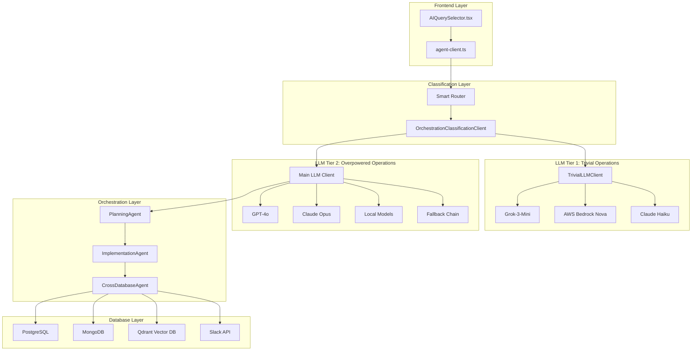

# LLM Infrastructure Overview: Ceneca's Multi-Tier AI System

## 🎯 Executive Summary

This document describes Ceneca's sophisticated **multi-tier LLM infrastructure** that intelligently routes queries between fast and powerful AI models to optimize both performance and cost. The system handles everything from simple text editing to complex cross-database analytics.

## 🏗️ Architecture Overview



## 🧠 Core Components

### 1. **Smart Classification System** (`OrchestrationClassificationClient`)

**Location**: `server/agent/llm/client.py` (lines 2906-3115)

**Purpose**: Ultra-fast 1-token LLM classification that routes queries in <300ms

**How it works**:
- Uses AWS Bedrock with Claude Haiku for 1-token responses
- Classifies queries as `TRIVIAL` or `DATA_ANALYSIS`
- Falls back to regex patterns if LLM unavailable
- Processes requests like:
  - `"fix my grammar"` → **TRIVIAL** → Fast client
  - `"analyze sales data"` → **DATA_ANALYSIS** → Overpowered client

**Key Features**:
```python
async def classify_operation(self, request: str, context: Dict[str, Any]) -> Dict[str, Any]:
    # Ultra-fast classification with 1-token limit
    prompt = f"""Classify this user request as either TRIVIAL or DATA_ANALYSIS.
    
    TRIVIAL operations (use fast client):
    - Grammar/spelling fixes
    - Tone adjustments  
    - Text formatting
    
    DATA_ANALYSIS operations (use powerful client):
    - Data analysis queries
    - Statistical calculations
    - Database operations
    
    Request: "{request}"
    Respond with exactly one token: TRIVIAL or DATA_ANALYSIS"""
```

### 2. **Trivial LLM Client** (`TrivialLLMClient`)

**Location**: `server/agent/llm/trivial_client.py` (646 lines)

**Purpose**: Lightning-fast text operations optimized for speed and cost

**Supported Providers**:
- **Grok-3-Mini** (X.AI) - Primary choice for speed
- **AWS Bedrock Nova Micro** - Ultra-fast inference
- **Claude Haiku** - Backup for quality
- **GPT-4o-Mini** - OpenAI fallback

**Capabilities**:
- Grammar and spelling fixes
- Tone adjustments (formal ↔ casual)
- Text formatting and structure
- Content generation
- Real-time streaming with diff preview
- Markdown formatting output
- Response caching (5-minute TTL)

**Performance**: 200-500ms response times, costs 10x less than main LLM

**Key Features**:
```python
# Universal prompt that handles all trivial operations
TRIVIAL_CONFIG = {
    "max_tokens": 500,
    "temperature": 0.3,
    "prompt": """You are an intelligent text assistant. Respond to the user's request directly.
    
    Always format your response with proper markdown:
    - Use **bold** for emphasis
    - Use *italic* for technical terms
    - Use `code` for commands
    - Use ## headings for sections
    - Use - bullet points for lists
    """
}
```

### 3. **Overpowered LLM Client** (`LLMClient` implementations)

**Location**: `server/agent/llm/client.py` (3116 lines)

**Purpose**: Handle complex operations requiring reasoning and tool usage

**Client Types**:

#### `OpenAIClient`
- **Models**: GPT-4o, GPT-4o-mini
- **Features**: Function calling, streaming, tool orchestration
- **Use Cases**: Primary for data analysis and complex reasoning

#### `AnthropicClient`
- **Models**: Claude-3-Opus, Claude-3-Sonnet
- **Features**: Long context, structured output
- **Use Cases**: Analysis, document processing

#### `FallbackLLMClient`
- **Purpose**: Automatic failover between providers
- **Logic**: Try primary → secondary → tertiary
- **Resilience**: Prevents single point of failure

#### `DummyLLMClient`
- **Purpose**: Testing and development
- **Features**: Simulated responses, no API costs
- **Modes**: Success, validation_fail, error

**Tools Available to Overpowered LLMs**:
```python
tools = [
    {
        "name": "get_metadata",
        "description": "Get database table and column metadata"
    },
    {
        "name": "run_summary_query", 
        "description": "Generate statistical summaries"
    },
    {
        "name": "run_targeted_query",
        "description": "Execute specific SQL with timeout protection"
    },
    {
        "name": "sample_data",
        "description": "Get representative data samples"
    },
    {
        "name": "generate_insights",
        "description": "Generate specific insights (outliers, trends, correlations)"
    }
]
```

### 4. **Frontend Router** (`AIQuerySelector.tsx`)

**Location**: `server/web/src/components/AIQuerySelector.tsx` (946 lines)

**Purpose**: Intelligent query routing and user interface

**Smart Routing Logic**:
```typescript
// 1. Classify query
const classification = await orchestrationAgent.classifyOperation(query, blockContext);

// 2. Route based on classification and available text
if (classification.tier === 'trivial' && sourceText.trim()) {
    // Route to trivial client for fast processing
    await handleTrivialOperation(query, sourceText);
} else {
    // Route to overpowered LLM for complex operations
    onQuerySubmit(query);
}
```

**UI Features**:
- Real-time streaming with diff preview
- Smart suggestions based on context
- Fallback handling with user feedback
- Performance metrics display

### 5. **Planning Agent** (`PlanningAgent`)

**Location**: `server/agent/db/orchestrator/planning_agent.py` (724 lines)

**Purpose**: Generate and validate cross-database query plans

**Workflow**:
1. **Classify Databases**: Determine which databases to query
2. **Schema Retrieval**: Get relevant table/collection schemas
3. **Plan Generation**: Create optimized query execution plan
4. **Validation**: Verify plan against schema registry
5. **Optimization**: Enhance performance and correctness

**Key Methods**:
```python
async def create_plan(self, question: str, optimize: bool = False) -> Tuple[QueryPlan, Dict[str, Any]]:
    # 1. Classify which databases are relevant
    db_types = await self._classify_databases(question)
    
    # 2. Get schema information
    schema_info = await self._get_schema_info(db_types, question)
    
    # 3. Generate the execution plan
    plan_dict = await self._generate_plan(question, db_types, schema_info)
    
    # 4. Validate the plan
    validation_result = await self._validate_plan(query_plan, question)
    
    # 5. Optimize if requested
    if optimize:
        plan_dict = await self._optimize_plan(plan_dict, registry_schemas)
```

### 6. **Implementation Agent** (`ImplementationAgent`)

**Location**: `server/agent/db/orchestrator/implementation_agent.py` (672 lines)

**Purpose**: Execute query plans with parallelism and error handling

**Key Features**:
- **Parallel Execution**: Run up to 4 operations concurrently
- **Retry Logic**: 3 attempts with exponential backoff
- **Timeout Protection**: 60-second operation limits
- **Result Aggregation**: Combine heterogeneous data sources
- **Performance Metrics**: Detailed execution tracking

**Execution Flow**:
```python
async def execute_plan(self, query_plan: QueryPlan, user_question: str, dry_run: bool = False) -> Dict[str, Any]:
    # 1. Prepare semaphore for controlled parallelism
    semaphore = asyncio.Semaphore(self.max_parallel_operations)
    
    # 2. Execute operations with dependency resolution
    while pending_operations:
        # Find operations ready to execute (dependencies satisfied)
        ready_operations = await self._resolve_dependencies(query_plan, execution_results)
        
        # Execute operations in parallel
        tasks = [self._execute_operation(op, semaphore) for op in ready_operations]
        results = await asyncio.gather(*tasks, return_exceptions=True)
        
    # 3. Aggregate results across databases
    final_result = await self.result_aggregator.aggregate_results(
        execution_results, user_question, query_plan.metadata
    )
```

## 🚀 Advanced Features

### **Streaming Support**
All LLM clients support real-time streaming:
```python
async def stream_operation(self, operation: str, text: str) -> AsyncIterator[Dict[str, Any]]:
    # Yield real-time chunks as they arrive
    yield {"type": "start", "operation": operation}
    yield {"type": "chunk", "content": partial_content}
    yield {"type": "complete", "result": final_result}
```

### **Caching Layer**
- **Trivial Operations**: 5-minute cache for repeated requests
- **Schema Metadata**: Session-level caching
- **LRU Cache**: Automatic cleanup of old entries

### **Error Handling & Resilience**
- **Graceful Degradation**: Falls back to simpler methods
- **Retry Logic**: Exponential backoff for transient failures
- **Circuit Breaker**: Prevents cascade failures
- **Observability**: Comprehensive logging and metrics

### **Performance Optimizations**
- **Connection Pooling**: Reuse database connections
- **Parallel Processing**: Concurrent query execution
- **Smart Batching**: Group related operations
- **Resource Limits**: Prevent resource exhaustion

## 📊 Performance Characteristics

| Operation Type | Routing | Response Time | Cost | Use Cases |
|----------------|---------|---------------|------|-----------|
| **Grammar Fix** | Trivial | 200-500ms | $0.001 | Text editing, formatting |
| **Tone Adjustment** | Trivial | 200-500ms | $0.001 | Professional ↔ casual |
| **Data Analysis** | Overpowered | 2-10s | $0.05-0.20 | SQL generation, insights |
| **Cross-DB Query** | Overpowered | 5-30s | $0.10-0.50 | Multi-source analytics |

## 🛠️ Tools and Integrations

### **Database Adapters**
- **PostgreSQL**: Full SQL support with connection pooling
- **MongoDB**: Aggregation pipelines and document queries
- **Qdrant**: Vector similarity search and filtering
- **Slack**: Message search and channel data

### **LLM Providers**
- **OpenAI**: GPT-4o, GPT-4o-mini
- **Anthropic**: Claude-3-Opus, Claude-3-Sonnet, Claude-3-Haiku
- **X.AI**: Grok-3-Mini (optimized for speed)
- **AWS Bedrock**: Nova models, Claude models

### **Monitoring & Observability**
- **Request Tracing**: End-to-end query tracking
- **Performance Metrics**: Response times, error rates
- **Cost Tracking**: Per-operation expense monitoring
- **Health Checks**: System status validation

## 🔧 Configuration & Deployment

### **Environment Variables**
```bash
# Primary LLM (Overpowered)
LLM_API_URL=https://api.openai.com/v1
LLM_API_KEY=sk-...
LLM_MODEL_NAME=gpt-4o

# Trivial LLM (Fast)
TRIVIAL_LLM_PROVIDER=grok
TRIVIAL_LLM_API_KEY=xai-...
TRIVIAL_LLM_ENABLED=true

# AWS Bedrock (Classification)
AWS_REGION=us-east-1
AWS_ACCESS_KEY_ID=...
AWS_SECRET_ACCESS_KEY=...

# Anthropic (Fallback)
ANTHROPIC_API_KEY=sk-ant-...
```

### **Deployment Options**
- **Docker**: Complete containerized deployment
- **Cloud**: AWS/GCP/Azure with auto-scaling
- **On-Premise**: Enterprise security requirements
- **Hybrid**: Sensitive data on-prem, AI in cloud

## 📁 Files to Share

To give your friend a complete picture, attach these key files:

### **Core LLM Infrastructure**
1. `server/agent/llm/client.py` - Main LLM client with all providers
2. `server/agent/llm/trivial_client.py` - Fast operations client
3. `server/web/src/components/AIQuerySelector.tsx` - Frontend router

### **Orchestration System**
4. `server/agent/db/orchestrator/planning_agent.py` - Query planning
5. `server/agent/db/orchestrator/implementation_agent.py` - Execution engine
6. `server/agent/db/orchestrator/cross_db_orchestrator.py` - Multi-DB coordination

### **Testing & Validation**
7. `test-orchestration-agent.ts` - Classification system tests
8. `tests/test_cross_db_orchestration.py` - Integration tests
9. `server/agent/llm/test_streaming.py` - Streaming functionality tests

### **Configuration & Templates**
10. `server/agent/llm/templates/` - LLM prompt templates
11. `server/agent/api/endpoints.py` - API endpoints and routing
12. `server/agent/config/settings.py` - Configuration management

### **Documentation**
13. `docs/cross-database-orchestration.md` - Detailed technical docs
14. This file: `docs/llm-infrastructure-overview.md` - High-level overview

## 💡 Why This Architecture?

1. **Performance**: Sub-second responses for common operations
2. **Cost Efficiency**: 10x cost reduction through smart routing
3. **Reliability**: Multiple fallback layers prevent failures
4. **Scalability**: Parallel processing handles high loads
5. **Flexibility**: Easy to add new LLM providers or capabilities
6. **Enterprise Ready**: On-premise deployment, audit trails, security

This infrastructure enables Ceneca to provide ChatGPT-level intelligence for complex data operations while maintaining the speed and cost-efficiency needed for real-time user interactions. 